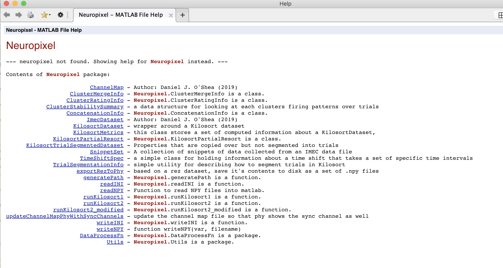

# Neuropixel Jankification ideas

## Code and repo organization

* Subfolder(s) for code root paths, instead of putting the root of the project itself on the Matlab path
* Example code (`trialDataExample.m`) in another code root folder, instead of at the root of the project
* Split the [packaged external dependencies](https://djoshea.github.io/neuropixel-utils/acknowledgements/) (libs from File Exchange) into a separate `lib/` directory, to make upgrading/upstreaming them easier
* A `doc-project` directory for maintainer-oriented documentation, like the `build_docs_readme.txt`, and style guides and Release Checklist we could add
* `.editorconfig`
* Move mkdocs source to `doc-src` and build them locally into `doc` for each release, so releases contain the doco that's correct for their version.

## Code style

* For property constraints, standardize whether there's a space between the property name and the `(m,n)` size indicator
* Settle on either `snake_case` or `camelCase` for property names? There's a mix of the two currently

## Packaging and distribution

* Switch to Semantic Versioning?
* Distribution tarballs?
* `Makefile` for building release

## API

* Use lowercase names for packages, per Matlab convention
* `+neuropixel/+internal` package for internal-use (non-public-API) functions
* A `neuropixel.globals` class for lib-wide things, like getVersion(), distroot(), global settings, user prefs, env var discovery, and so on?

## Documentation

* Helptext for classes, functions, and packages
  * `doc neuropixel` should be the entrypoint
  * Maybe do my hack for integration into the Matlab Help Browser?
  * I mean, eww:

## Coding

* How bout some unit test?
